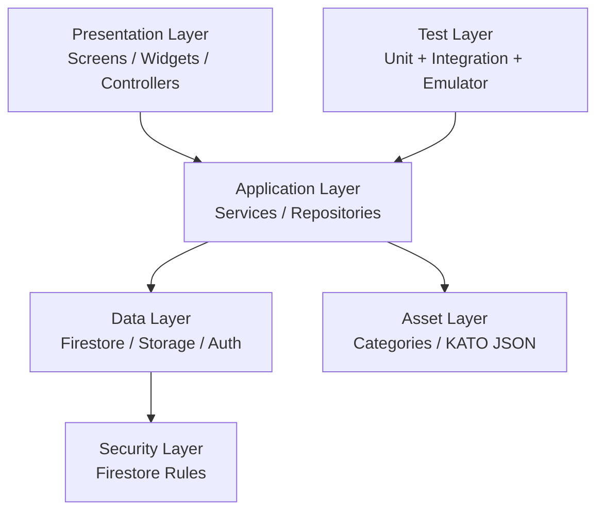

# NaqUsta

<p align="center">
  
</p>

<h1 align="center">NaqUsta</h1>
<p align="center">
  <strong>Find trusted workers. Post jobs in minutes. Build with confidence.</strong><br/>
  A full-scale Flutter marketplace connecting clients with skilled workers across construction, repair, and home services.
</p>

<p align="center">
  <a href="#english-version">🇬🇧 English</a> •
  <a href="#kazakh-version">🇰🇿 Қазақша</a>
</p>

---

<a id="english-version"></a>
## 🇬🇧 English Version

<a id="en-1-hero"></a>
## 1. Hero Section

**NaqUsta** is a production-minded Flutter application built to solve a practical, high-frequency problem: how to quickly find a reliable worker for real physical tasks. The app focuses on construction and repair workflows, where timing, trust, location coverage, and clear communication matter more than social engagement metrics.

NaqUsta serves two primary audiences:
- **Clients** who need jobs done fast (homeowners, tenants, small businesses).
- **Workers** who want qualified leads and transparent order flow.

This repository is not a toy prototype. It is a portfolio-grade, evolving product with a real architecture, domain-specific data models, Firebase-backed workflows, and practical quality controls.

**Project Snapshot**

| Metric | Value |
|---|---|
| Project Name | NaqUsta |
| Development Duration | 10 months (active) |
| Dart Source Files | 168 |
| Total Repository Files | 300+ |
| Primary Platform | Flutter (mobile-first) |
| Backend Services | Firebase (Auth, Firestore, Storage) |
| License | MIT |

---

<a id="en-2-badges"></a>
## 2. GitHub Badges

<p>
  
  
  
  
  
  
</p>

> If your repository slug is different, replace `TurginbayBekzat/NaqUsta` in badge URLs.

---

<a id="en-3-toc"></a>
## 3. Table of Contents

1. [Hero Section](#en-1-hero)
2. [GitHub Badges](#en-2-badges)
3. [Table of Contents](#en-3-toc)
4. [About the Project](#en-4-about)
5. [The Problem the Project Solves](#en-5-problem)
6. [The Solution](#en-6-solution)
7. [Key Features](#en-7-key-features)
8. [Feature List Table](#en-8-feature-table)
9. [Application Screens Overview](#en-9-screens-overview)
10. [UI/UX Philosophy](#en-10-ui-ux)
11. [Technology Stack](#en-11-tech-stack)
12. [Architecture Overview](#en-12-architecture-overview)
13. [System Architecture Explanation](#en-13-architecture-explanation)
14. [Folder Structure Tree](#en-14-folder-tree)
15. [Installation Guide](#en-15-installation)
16. [Running the Application](#en-16-running)
17. [Development Environment Setup](#en-17-dev-setup)
18. [Git Workflow Strategy](#en-18-git-workflow)
19. [Code Style Guidelines](#en-19-code-style)
20. [Performance Considerations](#en-20-performance)
21. [Security Considerations](#en-21-security)
22. [Scalability Considerations](#en-22-scalability)
23. [Screenshots Section](#en-23-screenshots)
24. [Demo Section](#en-24-demo)
25. [Roadmap](#en-25-roadmap)
26. [Future Improvements](#en-26-future)
27. [Contribution Guide](#en-27-contribution)
28. [License](#en-28-license)
29. [Author Section](#en-29-author)
30. [Contact Information](#en-30-contact)
31. [Acknowledgements](#en-31-ack)
32. [Final Conclusion](#en-32-conclusion)

---

<a id="en-4-about"></a>
## 4. About the Project

NaqUsta was built as a long-horizon product effort, not a weekend challenge. Development started approximately 10 months ago and has iterated through major architectural and product changes: onboarding redesigns, domain model hardening, category normalization, request workflow improvements, and operational test coverage with Firebase emulators.

At the product level, NaqUsta is a two-sided service platform:
- **Demand side**: clients create structured work requests, attach photos, set location and budget preferences, and receive offers from available workers.
- **Supply side**: workers complete profile and category setup, define coverage radius by administrative location level, monitor open orders, submit offers, chat with clients, and finish jobs through explicit state transitions.

At the engineering level, the codebase emphasizes practical architecture and maintainability:
- Feature-driven code organization with clear boundaries.
- Domain models that map directly to Firestore documents.
- Service layer abstractions for marketplace workflows.
- Category and location repositories that support localized, high-confidence selection.
- Integration tests covering critical transaction paths.

The repository currently includes 168 Dart files and over 300 total files, which reflects a meaningful product surface: authentication, registration, profile, categories, location, order publishing, offer negotiation, chat entry points, and role-specific navigation.

NaqUsta is also a strong portfolio artifact because it demonstrates real tradeoff handling. It balances user speed vs data quality, supports multilingual content, includes offline UX signaling, and uses security-aware data flows through Firestore rules and transaction-based updates.

Another important aspect of this project is its product discipline. Many student repositories demonstrate isolated technical ideas but do not represent an operable product lifecycle. NaqUsta takes a different path: it explicitly models lifecycle states, validates data boundaries, and maintains cross-role parity in user flows. This means features are added with attention to downstream impact, not only immediate UI output. For example, category decisions influence matching behavior, rule definitions, and profile structure simultaneously. Likewise, location normalization is not just a UI convenience; it is part of query performance and relevance quality. This consistency between interface, data contract, and backend rule logic is what elevates the repository from “a working app” to “a maintainable product foundation.”

The project also captures real implementation constraints. It is built under practical tradeoffs of time, tooling, and scope, while still preserving architectural intent. Some modules are intentionally straightforward to keep iteration speed high, but critical domains are guarded through typed models, transactions, and deterministic tests. That balance is exactly what modern startup engineering requires: deliver features continuously without collapsing long-term maintainability.

---

<a id="en-5-problem"></a>
## 5. The Problem the Project Solves

Finding a trustworthy specialist for practical work is usually fragmented and inefficient. Most people experience one or more of the following issues:

1. **Discovery fragmentation**
Potential workers are spread across social networks, chat groups, marketplaces, and personal recommendations. The client wastes time comparing inconsistent profiles.

2. **Low profile standardization**
Worker descriptions are often incomplete. Service scope, actual competencies, coverage area, and response speed are unclear, which increases failed contacts.

3. **Weak request structure**
Clients often post vague requests without category precision, photos, budget expectations, or location specificity, causing back-and-forth and poor matching.

4. **Trust and accountability gaps**
Without explicit lifecycle states, both parties face ambiguity: Is the job accepted? Is it in progress? Is it completed? Was feedback captured?

5. **Location mismatch**
In local service markets, distance and coverage are essential. If location data is unstructured, workers receive irrelevant leads and clients receive delayed responses.

6. **High operational friction**
When posting and accepting work takes too many steps, users fall back to unstructured chat channels, reducing both conversion and quality.

NaqUsta addresses these failures directly with structured entities, validated category trees, explicit order states, and role-specific UX that optimizes for practical completion, not just user engagement.

---

<a id="en-6-solution"></a>
## 6. The Solution

NaqUsta introduces a domain-first marketplace flow where each critical step is represented by a concrete model and a predictable service operation. Instead of loosely formatted ads, the platform builds a constrained but flexible pipeline:

1. **Identity and role resolution**
Users authenticate through Firebase Auth (phone OTP supported). An auth gate checks profile documents and routes users into client or worker experience with conflict/missing-profile handling.

2. **Structured profile setup**
Clients and workers complete role-specific registration. Workers select categories (primary and can-do), location coverage mode, and service metadata that improves discovery quality.

3. **High-quality request creation**
Clients publish orders with title, leaf-level category, description, optional photos, budget logic, and normalized location payload.

4. **Offer and acceptance flow**
Workers submit offers against open orders. Clients accept an offer; order transitions to `IN_PROGRESS`, and a chat context is established.

5. **Completion and review loop**
Both sides confirm completion with dual done flags. Completed orders support review submission, producing trust signals over time.

6. **Operational resilience**
The app includes connectivity monitoring overlays, loading overlays, and emulator-tested critical flows to reduce regressions during ongoing development.

By combining strict data contracts with user-facing simplicity, NaqUsta reduces uncertainty, improves matching relevance, and creates a reusable foundation for scaling service categories and regional coverage.

---

<a id="en-7-key-features"></a>
## 7. Key Features

### Product Capabilities

- 🔐 **Phone-based authentication and role-aware onboarding** using Firebase Auth.
- 👥 **Dual-role platform** for clients and workers with dedicated navigation and screens.
- 🧩 **Multilingual category system** (`kk/ru/en`) with searchable leaf-only selection.
- 📍 **Structured location model** based on KATO hierarchy and coverage modes (`exact`, `district`, `region`).
- 🧾 **Order publishing workflow** with category validation, budget logic, and optional photo attachments.
- 💬 **Offer lifecycle** where workers submit or update offers on open orders.
- ✅ **Order state machine** (`OPEN` → `IN_PROGRESS` → `COMPLETED`, plus cancellation paths).
- ⭐ **Review support** after completion for trust-building.
- 🛡️ **Firestore rules** that enforce actor permissions and immutable fields.
- 📶 **Offline visibility overlays** and retry actions to improve UX under weak connectivity.

### Engineering Capabilities

- 🧱 **Feature-oriented codebase layout** for long-term maintainability.
- 🔄 **Transaction-based writes** for high-integrity acceptance/offer actions.
- 🧠 **Repository-level caching and indices** for category and location datasets.
- 🧪 **Integration tests with Firebase Emulator Suite** for critical end-to-end logic.
- 🖼️ **Image upload pipeline** using compression + Firebase Storage.
- 🎯 **Reusable design tokens and themed components** in `lib/core/theme` and `lib/core/widgets`.

### Why This Matters

Together, these features move NaqUsta from “portfolio UI clone” into “product-oriented engineering asset.” The project demonstrates architecture decisions, domain modeling, data validation, UX contingencies, and testable workflows that mirror real startup product requirements.

---

<a id="en-8-feature-table"></a>
## 8. Feature List Table

### Core Feature Matrix

| Feature | Description | User Role | Current State |
|---|---|---|---|
| OTP / Auth Gate | Firebase-authenticated access with profile lookup routing | Shared | ✅ Implemented |
| Role Selection | Client vs Worker path resolution | Shared | ✅ Implemented |
| Client Registration | Profile setup and entry to client navigation | Client | ✅ Implemented |
| Worker Registration Steps | Multi-step setup with categories and location | Worker | ✅ Implemented |
| Category Picker (Leaf-Only) | Validates final service category nodes | Shared | ✅ Implemented |
| Category Search Index | Token/prefix multilingual search | Shared | ✅ Implemented |
| KATO Location Breakdown | Region/district/locality-aware structure | Shared | ✅ Implemented |
| Coverage Filtering | Exact/district/region query scoping | Worker | ✅ Implemented |
| Order Creation | Structured payload + photos + validations | Client | ✅ Implemented |
| Open Orders Feed | Live stream of open jobs | Worker | ✅ Implemented |
| Offer Submission | Send/update offer with price rules | Worker | ✅ Implemented |
| Accept Offer Flow | Client accepts worker and starts progress | Client | ✅ Implemented |
| Completion Confirmation | Worker/client dual done logic | Shared | ✅ Implemented |
| Review Submission | Post-completion rating flow | Client | ✅ Implemented |
| Offline Banner Overlay | Connectivity state feedback and retry | Shared | ✅ Implemented |
| App Loading Overlay | Centralized loading UX handling | Shared | ✅ Implemented |
| Critical Integration Tests | Emulator-backed flow verification | Shared | ✅ Implemented |

### Feature Comparison Table

| Capability | NaqUsta | Generic Classified App | Random Social/Chat Groups |
|---|---|---|---|
| Structured role model | ✅ Strong | ⚠️ Often partial | ❌ None |
| Leaf-level category validation | ✅ Yes | ⚠️ Usually broad tags | ❌ No |
| Location hierarchy support | ✅ KATO-aware | ⚠️ City-level only | ❌ Unstructured |
| Order lifecycle states | ✅ Explicit | ⚠️ Often implicit | ❌ Not tracked |
| Offer-to-accept workflow | ✅ Built-in | ⚠️ Inconsistent | ❌ Manual messaging |
| Rule-based backend permissions | ✅ Firestore rules | ⚠️ Varies | ❌ No enforcement |
| Integration-testable core flows | ✅ Emulator suite | ⚠️ Rare | ❌ Not applicable |
| Portfolio engineering depth | ✅ High | ⚠️ Medium | ❌ Low |

---

<a id="en-9-screens-overview"></a>
## 9. Application Screens Overview

NaqUsta includes a substantial set of user-facing screens covering authentication, registration, discovery, transactional operations, and profile management. The screen model is intentionally role-aware to keep each workflow short and context-specific.

### Client-Facing Screens

| Screen | Purpose |
|---|---|
| `RoleSelectionScreen` | Entry point for role choice |
| `ClientRegisterScreen` | Client profile completion |
| `ClientMainNavigation` | Main navigation shell |
| `ClientHomeScreen` | Discovery and featured worker context |
| `RequestCreateScreen` | Publish structured job request |
| `WorkerRequestFeedScreen` | Track relevant worker proposals/requests |
| `RequestDetailsScreen` | View lifecycle details and actions |
| `RequestHistoryScreen` | Historical requests and status |
| `ClientProfileScreen` | Profile summary and account data |
| `ClientEditProfileScreen` | Profile edits |
| `ClientSettingsScreen` | Preferences and settings |
| `ClientSupportScreen` | Support/help surface |

### Worker-Facing Screens

| Screen | Purpose |
|---|---|
| `WorkerRegistrationSteps` | Multi-step worker onboarding |
| `WorkerStep1Contact/Step2Profile` | Structured registration stages |
| `WorkerMainNavigation` | Main worker shell |
| `WorkerHomeScreen` | Open order feed and matching context |
| `WorkerJobDetailScreen` | Job details and action panel |
| `WorkerMyJobsScreen` | Accepted/completed job tracking |
| `WorkerChatListScreen` | Active conversations |
| `WorkerChatDetailScreen` | Transactional chat view |
| `WorkerProfileScreen` | Public and operational profile |
| `WorkerSettingsScreen` | Worker-side account settings |

### Shared and Infrastructure Screens

| Screen | Purpose |
|---|---|
| `AuthGate` | Auth state + profile existence routing |
| `LoginScreen` / OTP screens | Authentication flow |
| `CategoryPicker` | Category selection dialog/sheet |
| `LocationPicker` | Structured location selection |

The breadth of this screen inventory is one of NaqUsta’s strongest portfolio indicators: it demonstrates end-to-end thinking beyond isolated UI pages.

---

<a id="en-10-ui-ux"></a>
## 10. UI/UX Philosophy

NaqUsta’s UI/UX decisions are centered on **clarity, speed, and confidence**. In service marketplaces, users do not want decorative complexity; they want quick decision-making with low error probability.

### Design Principles

1. **Progressive disclosure**
Complex inputs such as category trees and location hierarchy are revealed in controlled steps to avoid cognitive overload.

2. **Role-focused navigation**
Client and worker interfaces are separated, reducing irrelevant UI and improving task completion speed.

3. **Feedback-rich interactions**
Loading states, offline banners, form validation messages, and explicit status labels are treated as first-class UX elements.

4. **Data confidence over visual noise**
Important metadata (category, location, budget, status) is consistently visible in transaction screens to reduce misunderstanding.

5. **Reusable design language**
Token-based theme definitions and shared widgets maintain consistency while allowing evolution.

### Interaction Quality Targets

- Minimize taps required to create or respond to an order.
- Avoid ambiguous state transitions.
- Surface constraints early (e.g., required fields, invalid pricing, missing category leaf).
- Keep critical actions obvious and reversible when possible.

This philosophy aligns with practical marketplace behavior where reliability and speed directly influence user retention.

---

<a id="en-11-tech-stack"></a>
## 11. Technology Stack

NaqUsta uses a modern Flutter + Firebase stack selected for rapid delivery, solid cross-platform behavior, and manageable operational complexity.

### Stack Overview

| Layer | Technologies |
|---|---|
| Frontend | Flutter, Dart |
| State & Flow | Stateful widgets, service/repository patterns, `ValueNotifier` where appropriate |
| Authentication | Firebase Auth (phone OTP flow support) |
| Data Store | Cloud Firestore |
| File Storage | Firebase Storage |
| Connectivity | `connectivity_plus` |
| Media | `image_picker`, `flutter_image_compress` |
| Audio/Voice | `record`, `just_audio` |
| UI Components | Material 3, custom core widgets, theme tokens |
| Testing | `flutter_test`, `integration_test`, Firebase Emulator Suite |
| Linting | `flutter_lints` |

### Key Dependencies (from `pubspec.yaml`)

| Package | Purpose |
|---|---|
| `firebase_core` | Firebase bootstrapping |
| `firebase_auth` | Authentication |
| `cloud_firestore` | Document database workflows |
| `firebase_storage` | Media upload/storage |
| `provider` | State composition in specific modules |
| `cached_network_image` | Efficient remote image rendering |
| `connectivity_plus` | Online/offline detection |
| `flutter_animate` | Interaction/transition polish |
| `lucide_icons` | Iconography |
| `image_picker` | User image selection |
| `flutter_image_compress` | Upload optimization |
| `path_provider` | Local file path access |

### Why This Stack Works for NaqUsta

- Firebase shortens backend iteration loops for a solo/portfolio startup workflow.
- Flutter enables a unified codebase for Android and iOS with consistent behavior.
- Emulator-backed integration tests provide confidence for transactional flows.
- The package set is pragmatic: focused on product needs, not framework experimentation.

---

<a id="en-12-architecture-overview"></a>
## 12. Architecture Overview

NaqUsta follows a **feature-driven, service-backed architecture** with clear separation between UI, domain models, and backend operations.

### High-Level Architecture



### Architectural Characteristics

- **Feature modules** under `lib/features/*` hold domain-specific UI and logic.
- **Core primitives** under `lib/core/*` contain reusable app-wide concerns (theme, shared widgets, connectivity/loading overlays).
- **Service classes** encapsulate external interactions and transaction logic.
- **Repository classes** handle data loading/indexing from local assets for categories and location.
- **Typed models** represent business entities and wire-format conversion behavior.

### Architectural Goal

The project aims to remain evolvable while preserving development velocity. It intentionally avoids premature abstraction layers that add complexity without product benefit.

---

<a id="en-13-architecture-explanation"></a>
## 13. System Architecture Explanation

This section explains how the major components collaborate in a real workflow.

### End-to-End Lifecycle (Example)

1. **User enters app**
`main.dart` initializes Firebase and global overlays, then renders `AuthGate`.

2. **Auth and profile routing**
`AuthGate` listens to auth state changes and runs profile lookup via `AuthProfileRepository`, routing to role-specific flows.

3. **Client publishes order**
`RequestCreateScreen` collects title/category/location/budget/photos. Category data is validated through `CategoryRepository`. Uploads go through `OrderService.uploadOrderPhotos()`, then order document is created.

4. **Worker discovers order**
`OrderService.streamOpenOrdersByCoverage()` applies coverage-aware query constraints using normalized location fields.

5. **Worker submits offer**
`OfferService.sendOrUpdateOffer()` runs transaction logic, validates order state, writes offer doc, and updates order counters atomically.

6. **Client accepts worker**
`OrderService.acceptWorkerOffer()` performs transactional updates to move order into `IN_PROGRESS`, assign worker, and ensure chat thread creation.

7. **Completion and review**
Worker and client mark done; when both flags are true, status becomes `COMPLETED`, and review submission becomes valid.

### Data Integrity Strategy

- Validate category leaf constraints both in app logic and Firestore rules.
- Keep immutable fields guarded after create (e.g., `clientId`, `createdAt`).
- Restrict updates by actor role and order ownership.
- Use transactions for state transitions that touch multiple fields/documents.

### Failure and Recovery Behavior

A robust architecture is defined not only by happy-path flow but by how safely it fails. NaqUsta includes explicit fallback behavior in key risk areas:

- If auth profile lookup fails, users see retry/exit actions instead of silent dead-ends.
- If connectivity drops, global overlays communicate network state without crashing active pages.
- If category or location payload is incomplete, request submission is blocked before write operations.
- If a worker attempts to offer on a non-open order, service-layer exceptions return meaningful feedback.
- If state transitions are invalid, Firestore rules reject the write, preserving data integrity even if client logic regresses.

This layered defensive model is intentional. UX-level validation handles common user errors early, service-level checks enforce domain expectations, and rule-level constraints provide final authority on sensitive writes. Together, these layers reduce corruption risk and simplify debugging because failures occur with clear context. For a transaction-centric marketplace, this approach is significantly safer than relying on any single validation boundary.

### Diagram Placeholder (Detailed)

```text
[Client App] ---> [OrderService] ---> [Firestore: orders]
      |                                 |
      |                                 +--> [Rules Validation]
      |
      +--> [Storage Uploads] ---> [Firebase Storage]

[Worker App] ---> [OfferService] ---> [Firestore: offers]
      |
      +--> [Order Counters Update] ---> [Firestore: orders]

[Both Roles] ---> [Completion + Review] ---> [orders/reviews/chats]
```

This architecture is intentionally optimized for correctness in marketplace transactions where ambiguous state is expensive.

---

<a id="en-14-folder-tree"></a>
## 14. Folder Structure Tree

Below is a practical tree snapshot of the repository structure.

```text
naqusta/
├─ android/
├─ ios/
├─ linux/
├─ macos/
├─ windows/
├─ web/
├─ assets/
│  ├─ data/
│  │  ├─ categories/
│  │  └─ kato/
│  ├─ images/
│  └─ locations/
├─ docs/
│  └─ category_system.md
├─ functions/
├─ integration_test/
│  ├─ README.md
│  └─ critical_flow_test.dart
├─ test/
│  └─ features/
│     ├─ categories/
│     └─ worker/registration/
├─ lib/
│  ├─ core/
│  │  ├─ data/
│  │  ├─ services/
│  │  ├─ theme/
│  │  └─ widgets/
│  ├─ data/
│  ├─ features/
│  │  ├─ auth/
│  │  ├─ categories/
│  │  ├─ client/
│  │  ├─ common/
│  │  ├─ location/
│  │  ├─ marketplace/
│  │  ├─ profile/
│  │  ├─ request/
│  │  └─ worker/
│  ├─ models/
│  ├─ screens/
│  ├─ services/
│  ├─ widgets/
│  ├─ firebase_options.dart
│  └─ main.dart
├─ firestore.rules
├─ pubspec.yaml
├─ LICENSE
└─ README.md
```

### Structure Notes

- `lib/features/*` is the primary product surface.
- `docs/category_system.md` documents category architecture and rules.
- `integration_test/critical_flow_test.dart` validates business-critical scenarios against emulators.
- `firestore.rules` is a core part of production safety, not an afterthought.

---

<a id="en-15-installation"></a>
## 15. Installation Guide

### Prerequisites

Before running NaqUsta locally, make sure the following are installed:

- Flutter SDK (3.24+ recommended)
- Dart SDK (compatible with project constraints; currently `^3.10.1`)
- Xcode (for iOS/macOS) and/or Android Studio
- Firebase CLI (`npm i -g firebase-tools`) for emulator workflows
- Git

### Clone and Install

```bash
git clone https://github.com/TurginbayBekzat/NaqUsta.git
cd NaqUsta
flutter pub get
```

### Firebase Setup

If you are connecting to a live Firebase project:

```bash
flutterfire configure
```

If project-specific config files are managed manually, ensure required files exist in platform folders:

- `android/app/google-services.json`
- `ios/GoogleService-Info.plist`
- `macos/Runner/GoogleService-Info.plist`

### Verify Environment

```bash
flutter doctor -v
flutter pub deps --style=compact
```

### Optional: Prepare Emulators for Integration Testing

```bash
firebase emulators:start --project naqusta --only auth,firestore,storage
```

This repository includes integration tests designed to run against Firebase emulators for deterministic behavior.

---

<a id="en-16-running"></a>
## 16. Running the Application

### Standard Run

```bash
flutter run
```

### Run on Specific Device

```bash
flutter devices
flutter run -d <device_id>
```

### Run with Verbose Logs

```bash
flutter run -v
```

### Run Unit and Widget Tests

```bash
flutter test
```

### Run Critical Integration Flow (Example)

```bash
firebase emulators:exec --project naqusta --only auth,firestore,storage \
  "flutter test integration_test/critical_flow_test.dart -d emulator-5554"
```

### Build Artifacts

```bash
flutter build apk --release
flutter build ios --release
```

### Notes for Daily Development

- For quick iteration, use a physical Android device or a warm emulator.
- Keep emulator suite running in a separate terminal when validating transactional flows.
- Watch for rule changes in `firestore.rules`; they can affect feature behavior immediately.

---
<a id="en-17-dev-setup"></a>
## 17. Development Environment Setup

A stable development environment is the difference between fast iteration and recurring friction. NaqUsta is structured to support both solo development and collaborative contribution.

### Recommended Tooling

- **IDE**: VS Code or Android Studio
- **Flutter plugins**: Flutter, Dart
- **Version control**: Git with conventional branch naming
- **Device targets**: Android emulator/physical, iOS simulator (macOS), optional web for quick visual checks

### Suggested Local Setup Checklist

1. Install Flutter and verify with `flutter doctor -v`.
2. Run `flutter pub get`.
3. Ensure Firebase config is present for your target platform.
4. Start emulator/simulator.
5. Run app once to warm generated artifacts.
6. Run tests before first feature branch change.

### Firebase Emulator-First Workflow

For backend-sensitive changes (orders/offers/chat/rules), use emulator suite by default:

```bash
firebase emulators:start --project naqusta --only auth,firestore,storage
```

Then in a second shell:

```bash
flutter test integration_test/critical_flow_test.dart -d emulator-5554
```

### Useful Daily Commands

```bash
flutter clean
flutter pub get
flutter analyze
flutter test
```

### Environment Consistency Tips

- Pin Flutter version in team docs or CI config.
- Keep `.gitignore` strict for local secrets and generated artifacts.
- Avoid editing generated files directly.
- Treat `firestore.rules` changes as application logic changes and test accordingly.

---

<a id="en-18-git-workflow"></a>
## 18. Git Workflow Strategy

NaqUsta benefits from a disciplined git strategy because feature velocity is high and transactional domains are sensitive to regressions.

### Branch Model

- `main`: stable branch, always releasable.
- `develop` (optional but recommended): integration branch for validated feature work.
- `feature/<scope>-<short-name>`: new functionality.
- `fix/<scope>-<issue>`: bugfixes.
- `chore/<scope>`: tooling/config/refactoring without behavior change.

### Commit Convention (Recommended)

Use semantic commit prefixes:

- `feat:` new feature
- `fix:` bug fix
- `refactor:` internal change without behavior shift
- `test:` test additions/changes
- `docs:` documentation updates
- `chore:` maintenance

Example:

```bash
git checkout -b feature/marketplace-offer-validation
git add .
git commit -m "feat: enforce leaf category validation in order creation"
```

### Pull Request Expectations

- One logical change per PR.
- Explain problem and solution with concise context.
- Include screenshots/video for UI changes.
- Reference related issue/task.
- Confirm analyzer/tests pass.

### Release Hygiene

- Squash or clean history where appropriate.
- Tag releases (`v1.0.0`, `v1.1.0`, etc.) when milestone-ready.
- Keep changelog notes for meaningful user-facing changes.

This strategy supports both startup speed and long-term maintainability.

---

<a id="en-19-code-style"></a>
## 19. Code Style Guidelines

Consistency is a force multiplier in multi-feature Flutter projects. NaqUsta follows practical conventions that reduce onboarding time and bug surface area.

### Style Baseline

- Use `flutter_lints` as a mandatory baseline.
- Prefer explicit, readable names for models/services/screens.
- Keep files focused: one primary concern per file.
- Avoid over-engineering abstractions before reuse is proven.

### Naming Conventions

- `*Screen` for pages/routes.
- `*Service` for backend interaction and workflow orchestration.
- `*Repository` for data access/loading/indexing concerns.
- `*Model` for domain entities and DTO-like structures.

### Widget and UI Guidelines

- Extract reusable UI atoms into `lib/core/widgets`.
- Keep business logic outside visual widgets when possible.
- Preserve role-based boundaries between client and worker modules.

### Error Handling

- Throw domain-aware exceptions for user-facing actions (`MarketplaceException`, etc.).
- Convert low-level failures into meaningful messages.
- Avoid silent catch blocks unless explicitly justified.

### Testability Rules

- Keep service methods deterministic where possible.
- Isolate Firebase interactions in service/repository layers.
- Add/adjust tests for behavior-changing updates.

### Formatting Commands

```bash
dart format .
flutter analyze
```

---

<a id="en-20-performance"></a>
## 20. Performance Considerations

Performance in NaqUsta is treated as a product requirement, not a post-launch optimization task. Marketplace apps lose trust quickly when feeds lag, forms freeze, or media uploads stall.

### Current Performance-Oriented Decisions

- **Image compression before upload** reduces bandwidth and upload time.
- **Indexed/cached category lookup** avoids repeated heavy parsing and improves picker responsiveness.
- **Stream-based Firestore listeners** deliver near-real-time updates without polling overhead.
- **Scoped queries by coverage mode** reduce data transfer and irrelevant results.
- **Lightweight overlay feedback** keeps users informed during network transitions.

### Operational Guidelines

- Keep Firestore documents compact and denormalize only where query performance benefits clearly justify it.
- Avoid expensive synchronous processing in widget build methods.
- Use memoization/caching for frequently reused static datasets.
- Watch list rendering patterns; use lazy builders and avoid deep rebuild cascades.

### Performance Testing Ideas

- Measure time-to-first-open-order on cold app start.
- Track image upload median/95th percentile on mobile networks.
- Benchmark category search latency across language variants.
- Profile frame times on lower-end Android devices.

### Future Optimization Tracks

- Add pagination for large feeds.
- Introduce lightweight local persistence for selected datasets.
- Add analytics instrumentation for real-world bottleneck visibility.

### Practical Performance Budgeting

As NaqUsta grows, lightweight performance budgets should become part of release criteria. A practical baseline could include:

- Home/feed first meaningful data render under 1.5s on a mid-tier device (warm network).
- Request publish action completion (excluding large image upload) under 1.0s after validation.
- Category picker search response under 120ms for typical query lengths.
- No sustained frame drops below 55 FPS on primary navigation flows.

These targets are realistic for a Flutter + Firebase application and can be tracked with profiling sessions during milestone releases. Defining and measuring such budgets helps teams avoid invisible performance drift, where each small feature seems acceptable but combined impact degrades user trust. Marketplace UX depends on responsiveness during high-intent actions; measurable budgets keep that priority visible.

---

<a id="en-21-security"></a>
## 21. Security Considerations

Security and integrity are central to NaqUsta because it handles identity, contact surfaces, and transactional workflows between independent users.

### Existing Security Layers

1. **Authentication boundary**
Only authenticated users can enter privileged workflows.

2. **Role-aware profile checks**
Auth gate and profile repository reduce role confusion and document conflict cases.

3. **Firestore rules enforcement**
`firestore.rules` contains actor-based permission checks, immutable field guards, status transition constraints, and category payload validations.

4. **Transactional state updates**
Critical updates (offer submission, accept worker, completion path) rely on Firestore transactions to prevent race-condition corruption.

5. **Asset/data validation**
Category IDs and paths are validated before write to reduce malformed data creation.

### Sensitive Data Practices

- Firebase config files should be environment-managed and not casually shared.
- Local secret/config artifacts belong in `.gitignore`.
- Never trust client input without rule-side validation.

### Security Hardening Checklist

- [ ] Add App Check for stronger backend resource protection.
- [ ] Add rate limiting strategy for abuse-prone endpoints/actions.
- [ ] Introduce audit-style metadata for sensitive transitions.
- [ ] Expand rules tests for negative/attack-path scenarios.
- [ ] Add security-focused CI checks for rules deployment.

Security maturity is iterative. NaqUsta already includes strong foundations for a portfolio project and can continue to mature into production-grade rigor.

---

<a id="en-22-scalability"></a>
## 22. Scalability Considerations

NaqUsta’s architecture is intentionally designed to scale by feature and geography without a full rewrite.

### Data Scalability

- Denormalized location fields (`katoCode`, district, region) support filtered queries as dataset grows.
- Offer and order counters reduce expensive aggregation patterns for common UI views.
- Category tree indexing enables efficient search even as taxonomy expands.

### Product Scalability

- Role-separated modules reduce cross-feature coupling.
- Service layer boundaries make it easier to introduce alternative backends or domain services.
- The current model can support additional service verticals beyond construction with controlled taxonomy extensions.

### Team Scalability

- Feature folders enable parallel contributor work with fewer merge collisions.
- Explicit repository/service model patterns help new contributors onboard faster.
- Integration tests offer a safety net for multi-person iteration.

### Infrastructure Scalability Paths

- Add Cloud Functions for server-authoritative actions where needed.
- Introduce scheduled moderation/ranking jobs.
- Add materialized ranking collections for high-demand cities.
- Move toward observability stack (analytics + logs + alerts).

### Potential Bottlenecks to Watch

- Unpaginated feeds in large-market scenarios.
- Hotspot documents if counters are centralized incorrectly.
- Media storage cost growth without lifecycle management.

NaqUsta already has a practical base for next-stage scaling while keeping development friction manageable.

---

<a id="en-23-screenshots"></a>
## 23. Screenshots Section (Placeholder)

> Replace placeholders below with real screenshots from your app.

### Suggested Screenshot Gallery

| Flow | Placeholder |
|---|---|
| Welcome / Role Selection | `` |
| Client Home | `` |
| Request Creation | `` |
| Worker Home Feed | `` |
| Offer Submission | `` |
| Chat Detail | `` |
| Worker Profile | `` |
| Settings | `` |

### Gallery Placeholder Block

```text
[ SCREENSHOT GRID PLACEHOLDER ]
+----------------+----------------+
| Client screens | Worker screens |
+----------------+----------------+
| Auth flow      | Feed flow      |
| Request flow   | Offer flow     |
| Profile flow   | Job flow       |
+----------------+----------------+
```

---

<a id="en-24-demo"></a>
## 24. Demo Section

A polished demo significantly increases repository credibility. For NaqUsta, the ideal demo package includes:

- 60-120 second product walkthrough video.
- Role-based split demo (client perspective + worker perspective).
- One full transactional scenario from order creation to completion.

### Demo Placeholder Links

- 🎥 Product Demo Video: `https://your-demo-link-here`
- 📱 Android APK (if shared): `https://your-apk-link-here`
- 🧪 Integration Test Run Recording: `https://your-test-demo-link-here`

### Suggested Demo Script

1. Login and role selection.
2. Client creates a category-specific order with location.
3. Worker sees order in open feed and sends offer.
4. Client accepts offer; chat is created.
5. Completion + review.

---

<a id="en-25-roadmap"></a>
## 25. Roadmap

NaqUsta is actively evolving. The roadmap below reflects practical product and engineering priorities.

### Roadmap Checklist

- [x] Core authentication and role selection
- [x] Worker/client registration flows
- [x] Category tree and multilingual search
- [x] KATO-based location modeling
- [x] Order creation and open order streams
- [x] Offer send/update flow
- [x] Accept worker and completion lifecycle
- [x] Critical emulator-backed integration tests
- [ ] Advanced chat features (attachments, read receipts)
- [ ] Push notifications for offers and status changes
- [ ] Worker ranking and recommendation algorithms
- [ ] In-app dispute and resolution workflow
- [ ] Admin moderation tooling
- [ ] Payment integration and escrow-like flow
- [ ] Analytics dashboard for operational metrics

### Milestone View

| Milestone | Focus |
|---|---|
| M1 | Foundation (auth, profiles, navigation) |
| M2 | Marketplace core (orders, offers, statuses) |
| M3 | Trust loop (reviews, consistency improvements) |
| M4 | Operational quality (tests, rules hardening) |
| M5 | Growth features (notifications, ranking, payments) |

---

<a id="en-26-future"></a>
## 26. Future Improvements

The current implementation provides a strong baseline, but several high-impact expansions can elevate NaqUsta toward production readiness.

### Product Improvements

- **Smart matching**: combine category relevance, coverage proximity, historical ratings, and response speed.
- **Reputation quality**: richer review dimensions (quality, speed, communication, price fairness).
- **Client-side recommendation feed**: personalized worker cards based on past behavior.
- **Service bundles**: allow workers to package related services with transparent pricing.

### Platform Improvements

- **Notification orchestration** via Firebase Cloud Messaging.
- **Light admin console** for moderation and dispute escalation.
- **Fraud/abuse detection signals** around suspicious offer patterns.
- **Localization expansion** beyond current languages as demand grows.

### Engineering Improvements

- Add CI pipeline (analyze + test + integration smoke).
- Improve test coverage for security rule edge cases.
- Introduce stronger domain-level validation utilities.
- Add observability events for conversion and drop-off funnels.

### Developer Experience Improvements

- Setup scripts for one-command local bootstrap.
- Shared docs for architecture decisions (ADR-style).
- Contributor templates (issue/PR checklists, feature RFC drafts).

---

<a id="en-27-contribution"></a>
## 27. Contribution Guide

Contributions are welcome, especially those that improve code quality, UX clarity, reliability, and documentation.

### How to Contribute

1. Fork the repository.
2. Create a branch:

```bash
git checkout -b feature/your-change-name
```

3. Make focused changes.
4. Run quality checks:

```bash
dart format .
flutter analyze
flutter test
```

5. If your change affects transactional flows, run integration tests with emulators.
6. Commit with clear semantic message.
7. Open a pull request with context and testing proof.

### PR Quality Checklist

- [ ] Change is scoped and logically coherent
- [ ] Analyzer passes
- [ ] Tests added/updated where needed
- [ ] No secrets or local files committed
- [ ] README/docs updated if behavior changed
- [ ] Screenshots included for UI updates

### Developer Workflow Explanation

A healthy contributor workflow for NaqUsta:

1. Pull latest base branch.
2. Implement one cohesive feature/fix.
3. Validate with unit/integration checks.
4. Open PR with concise architectural rationale.
5. Iterate on review feedback quickly.

This keeps delivery speed high while preserving repository quality.

### Suggested Contribution Areas

If you are looking for high-impact ways to contribute, the following areas are especially valuable:

- Strengthen automated testing around edge-case order transitions and offer conflict scenarios.
- Expand accessibility and localization coverage for mixed-language interfaces.
- Improve developer tooling (scripts, CI presets, local bootstrap automation).
- Add observability hooks for conversion funnels and drop-off analysis.
- Refine documentation around architecture decisions and module boundaries.

Contributors who align changes with these strategic areas can significantly improve the repository’s practical value. When opening a contribution, include a short note on expected product impact (for users) and technical impact (for maintainability/performance/security). This habit improves review quality and helps prioritize merges in a product-oriented way.

---

<a id="en-28-license"></a>
## 28. License

NaqUsta is distributed under the **MIT License**.

See [LICENSE](LICENSE) for full legal text.

```text
MIT License
Copyright (c) 2026 Turginbay
```

---

<a id="en-29-author"></a>
## 29. Author Section

**Turginbay Bekzat**

- 🎓 University: **Satbayev University**
- 🧑‍🎓 Academic Stage: **2nd year student**
- 💻 Field: **Information Technology**
- 🚀 Project Type: **Full-scale portfolio Flutter application**

NaqUsta reflects practical product engineering over a sustained development period. It demonstrates not only Flutter UI implementation, but also backend integration, domain modeling, security-aware data workflows, test strategy, and architecture-level thinking.

---

<a id="en-30-contact"></a>
## 30. Contact Information

For collaboration, feedback, internships, or technical discussion:

- GitHub: `https://github.com/TurginbayBekzat`
- Repository: `https://github.com/TurginbayBekzat/NaqUsta`
- Email: `bekzat.turginbay@proton.me` *(update if needed)*
- LinkedIn: `https://www.linkedin.com/in/turginbay-bekzat` *(update if needed)*

If some contact links are placeholders, replace them with your active public profiles.

---

<a id="en-31-ack"></a>
## 31. Acknowledgements

NaqUsta builds on excellent open ecosystems and educational foundations.

- Flutter and Dart communities for framework quality and developer tooling.
- Firebase team for practical backend-as-a-service capabilities.
- Open-source maintainers of packages used in this project.
- Satbayev University environment for supporting continuous technical growth.
- Early reviewers and testers who provided feedback on UX and workflows.

Special thanks to everyone who contributes through issues, pull requests, testing, and honest product feedback. Real-world comments are the fastest path to a better marketplace product.

---

<a id="en-32-conclusion"></a>
## 32. Final Conclusion

NaqUsta represents a serious, startup-minded engineering effort focused on solving a real market problem in local services. It combines product clarity, practical domain architecture, Firebase transaction integrity, and a continuously improving codebase.

From a portfolio perspective, this repository demonstrates:
- End-to-end product ownership.
- Feature-driven architecture decisions.
- Security and data integrity awareness.
- Testing discipline with emulator-backed critical flows.
- Long-term maintainability mindset.

From a product perspective, NaqUsta already establishes a strong foundation for growth: richer matching logic, stronger trust mechanisms, expanded communication tools, and monetization workflows can be layered on top of the current architecture without rethinking the core system.

If you are reviewing this repository as an engineer, mentor, recruiter, or collaborator, the best way to evaluate it is to run the app, inspect the architecture paths, and execute the critical integration tests. The value of NaqUsta is in its practical coherence: it is designed to be worked on, extended, and shipped.

---

<a id="kazakh-version"></a>
## 🇰🇿 Қазақша нұсқа

> This section is a full Kazakh translation of the same README structure.

<a id="kz-1-hero"></a>
## 1. Hero Section

**NaqUsta** - нақты өмірдегі маңызды мәселеге бағытталған Flutter қолданбасы: сенімді маманды жылдам табу және тапсырысты түсінікті форматта жүргізу. Платформа құрылыс, жөндеу, монтаж, тұрмыстық сервис сияқты практикалық қызметтерге бейімделген.

NaqUsta екі негізгі аудиторияға жұмыс істейді:
- **Клиенттер** - жұмысты тез әрі сапалы орындағысы келетін тапсырыс берушілер.
- **Шеберлер** - біліктілігіне сай тапсырыс алғысы келетін мамандар.

Бұл жоба жай демонстрациялық макет емес. Репозиторийде нақты архитектура, домендік модельдер, Firebase-пен толық интеграция, ережелермен қорғалған бизнес-процестер және интеграциялық тесттер бар.

**Жоба туралы қысқаша мәлімет**

| Көрсеткіш | Мәні |
|---|---|
| Жоба атауы | NaqUsta |
| Даму уақыты | 10 ай (белсенді) |
| Dart файлдары | 168 |
| Жалпы файл саны | 300+ |
| Негізгі платформа | Flutter (mobile-first) |
| Бэкенд сервистері | Firebase (Auth, Firestore, Storage) |
| Лицензия | MIT |

---

<a id="kz-2-badges"></a>
## 2. GitHub Badges

<p>
  
  
  
  
  
  
</p>

> Егер сіздің репо адресіңіз басқа болса, badge URL-дегі `TurginbayBekzat/NaqUsta` мәнін ауыстырыңыз.

---

<a id="kz-3-toc"></a>
## 3. Table of Contents

1. [Hero Section](#kz-1-hero)
2. [GitHub Badges](#kz-2-badges)
3. [Table of Contents](#kz-3-toc)
4. [About the Project](#kz-4-about)
5. [The Problem the Project Solves](#kz-5-problem)
6. [The Solution](#kz-6-solution)
7. [Key Features](#kz-7-key-features)
8. [Feature List Table](#kz-8-feature-table)
9. [Application Screens Overview](#kz-9-screens-overview)
10. [UI/UX Philosophy](#kz-10-ui-ux)
11. [Technology Stack](#kz-11-tech-stack)
12. [Architecture Overview](#kz-12-architecture-overview)
13. [System Architecture Explanation](#kz-13-architecture-explanation)
14. [Folder Structure Tree](#kz-14-folder-tree)
15. [Installation Guide](#kz-15-installation)
16. [Running the Application](#kz-16-running)
17. [Development Environment Setup](#kz-17-dev-setup)
18. [Git Workflow Strategy](#kz-18-git-workflow)
19. [Code Style Guidelines](#kz-19-code-style)
20. [Performance Considerations](#kz-20-performance)
21. [Security Considerations](#kz-21-security)
22. [Scalability Considerations](#kz-22-scalability)
23. [Screenshots Section](#kz-23-screenshots)
24. [Demo Section](#kz-24-demo)
25. [Roadmap](#kz-25-roadmap)
26. [Future Improvements](#kz-26-future)
27. [Contribution Guide](#kz-27-contribution)
28. [License](#kz-28-license)
29. [Author Section](#kz-29-author)
30. [Contact Information](#kz-30-contact)
31. [Acknowledgements](#kz-31-ack)
32. [Final Conclusion](#kz-32-conclusion)

---

<a id="kz-4-about"></a>
## 4. About the Project

NaqUsta шамамен 10 ай бойы дамып келе жатқан, нақты өнімдік талаптарға бағытталған Flutter жобасы. Бұл репозиторийде тек интерфейс емес, толық нарықтық логика қамтылған: аутентификация, рөлге байланысты маршруттау, шебер мен клиентті тіркеу, категория және локация деректерін құрылымдау, тапсырыс жариялау, ұсыныс қабылдау, жұмыс күйін басқару, пікір қалдыру және интеграциялық тесттер.

Жоба екіжақты маркетплейс ретінде құрылған:
- **Сұраныс жағы**: клиент тапсырыс жариялап, категория, баға, мекенжай, сипаттама және фото қосады.
- **Ұсыныс жағы**: шебер профиль толтырып, қызмет санатын таңдап, аумақтық қамтуын белгілеп, ашық тапсырыстарға ұсыныс жібереді.

Кодбазаның негізгі инженерлік артықшылықтары:
- Фичаға бөлінген құрылым (`lib/features/*`).
- Домен модельдері мен Firestore құжаттары арасындағы түсінікті сәйкестік.
- Сервис/репозиторий қабаттары арқылы логиканы бөлу.
- Категория және локация деректері үшін кэш және индекстеу.
- Firebase Emulator Suite арқылы критикалық сценарийлерді тексеру.

168 Dart файлы мен 300+ жалпы файл жобаның кең функционалын көрсетеді. Бұл деңгей студенттік портфолиода сирек кездеседі және нақты өнім жасау қабілетін дәлелдейді.

NaqUsta-ның құндылығы - UX қарапайымдылығы мен дерек тұтастығын бірге ұстауында. Яғни қолданушыға жылдам әрекет, жүйеге нақты және тексерілетін дерек.

---

<a id="kz-5-problem"></a>
## 5. The Problem the Project Solves

Қызмет көрсететін шеберді табу көбіне жүйесіз жүреді. Көпшілік келесі қиындықтарға тап болады:

1. **Дерек көздерінің шашыраңқылығы**
Шеберлер түрлі чаттарда, әлеуметтік желілерде, жарнама сайттарында шашырап жүреді. Клиент көп уақытын тек іздеуге жұмсайды.

2. **Профиль стандартының болмауы**
Көп хабарламаларда нақты мамандану, қызмет ауқымы, жұмыс аймағы, баға саясаты толық көрсетілмейді.

3. **Тапсырыс сапасының төмендігі**
Категориясыз, фотосыз, түсініксіз сипаттамамен жарияланған өтінімге дұрыс маман табу қиын.

4. **Процесс күйінің айқын еместігі**
Тапсырыс қабылданды ма, жұмыс басталды ма, аяқталды ма - көп жерде анық көрсетілмейді.

5. **Локация сәйкессіздігі**
Шебердің қамту аймағы мен клиенттің орналасуы нақты байланыспаса, жауап беру уақыты артады, конверсия төмендейді.

6. **Операциялық үйкеліс**
Тапсырыс беру және ұсыныс қабылдау процесі ұзақ болса, пайдаланушы платформада қалмайды.

NaqUsta осы мәселелерді құрылымдалған деректер, нақты өмірлік цикл күйі, категория/локация валидациясы және рөлге бейімделген UI арқылы шешеді.

---

<a id="kz-6-solution"></a>
## 6. The Solution

NaqUsta шешімі - доменге бағытталған, транзакцияға сенімді маркетплейс ағыны. Еркін мәтіндік жарнаманың орнына жүйе нақты қадамдарды ұсынады:

1. **Аутентификация және рөлді анықтау**
Пайдаланушы Firebase Auth арқылы кіреді, `AuthGate` профиль құжаттарын тексеріп, дұрыс рөлге бағыттайды.

2. **Рөлге сай тіркеу**
Клиент пен шеберге бөлек onboarding ағымы бар. Шебер категория, қызмет аумағы, профиль деректерін нақты толтырады.

3. **Құрылымдалған тапсырыс жариялау**
Клиент leaf-деңгей категориясын таңдайды, баға/келісім режимін орнатады, локация мен фото қосады.

4. **Ұсыныс және қабылдау логикасы**
Шебер ашық тапсырысқа ұсыныс жібереді, клиент қабылдағаннан кейін тапсырыс `IN_PROGRESS` күйіне өтеді.

5. **Аяқтау және пікір циклі**
Екі тарап та аяқталуын растаған кезде тапсырыс `COMPLETED` болады, кейін бағалау/пікір жазылады.

6. **Тұрақты UX және сапа бақылауы**
Offline overlay, loading overlay және интеграциялық тесттер жүйенің сенімділігін күшейтеді.

Осылайша NaqUsta қолданушыға жылдамдық береді, ал жүйеге болжамды және кеңейтілетін архитектура береді.

---

<a id="kz-7-key-features"></a>
## 7. Key Features

### Өнімдік мүмкіндіктер

- 🔐 **Телефон OTP арқылы кіру және рөлге тәуелді onboarding**.
- 👥 **Клиент/Шебер екі рөлді экожүйе**.
- 🧩 **Көптілді категория жүйесі** (`kk/ru/en`) және leaf-only таңдау.
- 📍 **KATO негізіндегі локация моделі** (`exact`, `district`, `region`).
- 🧾 **Тапсырыс жариялау ағыны** (баға, локация, сипаттама, фото).
- 💬 **Ұсыныс жіберу/жаңарту механизмі**.
- ✅ **Тапсырыс күй машинасы** (`OPEN`, `IN_PROGRESS`, `COMPLETED`, cancel).
- ⭐ **Пікір қалдыру циклі** (аяқталған тапсырыс үшін).
- 🛡️ **Firestore rules арқылы қорғаныс және валидация**.
- 📶 **Offline жағдайын көрсету және қайта тексеру әрекеті**.

### Инженерлік мүмкіндіктер

- 🧱 **Feature-driven архитектура**.
- 🔄 **Транзакциялық write операциялары**.
- 🧠 **Кэш және индекстеу** (категория/локация).
- 🧪 **Firebase emulator арқылы критикалық интеграциялық тесттер**.
- 🖼️ **Суретті сығымдап upload жасау**.
- 🎯 **Ортақ дизайн токендері мен core widget жинағы**.

### Неліктен маңызды?

Бұл мүмкіндіктер NaqUsta-ны жай UI жобасынан шығарып, өнімдік архитектурасы бар практикалық инженерлік репозиторий деңгейіне көтереді.

---

<a id="kz-8-feature-table"></a>
## 8. Feature List Table

### Негізгі функционал матрицасы

| Функция | Сипаттама | Рөл | Күйі |
|---|---|---|---|
| OTP / Auth Gate | Профильге қарай маршруттау | Ортақ | ✅ Дайын |
| Role Selection | Клиент/шебер ағынын таңдау | Ортақ | ✅ Дайын |
| Client Registration | Клиент профилін толықтыру | Клиент | ✅ Дайын |
| Worker Registration Steps | Көп қадамды шебер тіркеуі | Шебер | ✅ Дайын |
| Category Picker (Leaf) | Соңғы категория түйінін таңдау | Ортақ | ✅ Дайын |
| Category Search Index | Көптілді іздеу индексациясы | Ортақ | ✅ Дайын |
| KATO Location Breakdown | Аймақ/аудан/елді мекен құрылымы | Ортақ | ✅ Дайын |
| Coverage Filtering | Қамту режимімен тапсырыс сүзу | Шебер | ✅ Дайын |
| Order Creation | Құрылымдалған тапсырыс құру | Клиент | ✅ Дайын |
| Open Orders Feed | Ашық тапсырыстар ағыны | Шебер | ✅ Дайын |
| Offer Submission | Ұсыныс жіберу/жаңарту | Шебер | ✅ Дайын |
| Accept Offer Flow | Клиенттің шеберді қабылдауы | Клиент | ✅ Дайын |
| Completion Confirmation | Екі тараптан аяқтау растауы | Ортақ | ✅ Дайын |
| Review Submission | Бағалау/пікір қалдыру | Клиент | ✅ Дайын |
| Offline Banner Overlay | Интернет күйі туралы хабарлама | Ортақ | ✅ Дайын |
| App Loading Overlay | Ортақ жүктеу UI басқаруы | Ортақ | ✅ Дайын |
| Critical Integration Tests | Критикалық сценарий тесттері | Ортақ | ✅ Дайын |

### Салыстырмалы кесте

| Мүмкіндік | NaqUsta | Қарапайым хабарландыру сервисі | Әлеуметтік чат топтары |
|---|---|---|---|
| Рөлдік модель | ✅ Нақты | ⚠️ Толық емес | ❌ Жоқ |
| Leaf-level категория | ✅ Бар | ⚠️ Көбіне жалпы | ❌ Жоқ |
| Иерархиялық локация | ✅ KATO | ⚠️ Қала деңгейі | ❌ Еркін мәтін |
| Тапсырыс күйі | ✅ Айқын | ⚠️ Шектеулі | ❌ Қадағаланбайды |
| Ұсыныс-қабылдау ағыны | ✅ Бар | ⚠️ Әртүрлі | ❌ Қолмен |
| Rules арқылы қорғау | ✅ Бар | ⚠️ Әр жобаға байланысты | ❌ Жоқ |
| Интеграциялық тест жарамдылығы | ✅ Жоғары | ⚠️ Орташа | ❌ Жоқ |
| Портфолио инженерлік құндылығы | ✅ Жоғары | ⚠️ Орташа | ❌ Төмен |

---

<a id="kz-9-screens-overview"></a>
## 9. Application Screens Overview

NaqUsta-да аутентификациядан бастап тапсырыс жабуға дейінгі толық экрандар жиыны бар. Экрандар рөл бойынша бөлінген, бұл пайдаланушы жолын қысқартады және шатасуды азайтады.

### Клиент экрандары

| Экран | Мақсаты |
|---|---|
| `RoleSelectionScreen` | Бастапқы рөл таңдау |
| `ClientRegisterScreen` | Клиент профилін аяқтау |
| `ClientMainNavigation` | Клиент негізгі навигациясы |
| `ClientHomeScreen` | Іздеу және ұсынылатын шеберлер |
| `RequestCreateScreen` | Жаңа тапсырыс жариялау |
| `WorkerRequestFeedScreen` | Тапсырысқа қатысты ұсыныстар |
| `RequestDetailsScreen` | Тапсырыс күйі және әрекеттер |
| `RequestHistoryScreen` | Тарих |
| `ClientProfileScreen` | Профиль көру |
| `ClientEditProfileScreen` | Профиль өңдеу |
| `ClientSettingsScreen` | Баптаулар |
| `ClientSupportScreen` | Қолдау беті |

### Шебер экрандары

| Экран | Мақсаты |
|---|---|
| `WorkerRegistrationSteps` | Көп қадамды тіркеу |
| `WorkerStep1Contact/Step2Profile` | Тіркеу сатылары |
| `WorkerMainNavigation` | Шебер негізгі навигациясы |
| `WorkerHomeScreen` | Ашық тапсырыс лентасы |
| `WorkerJobDetailScreen` | Тапсырыс детальдары |
| `WorkerMyJobsScreen` | Қабылданған/аяқталған жұмыстар |
| `WorkerChatListScreen` | Чаттар тізімі |
| `WorkerChatDetailScreen` | Чат детальдары |
| `WorkerProfileScreen` | Шебер профилі |
| `WorkerSettingsScreen` | Шебер баптаулары |

### Ортақ және инфрақұрылым экрандары

| Экран | Мақсаты |
|---|---|
| `AuthGate` | Auth + профиль күйін тексеру |
| `LoginScreen` / OTP screens | Кіру ағыны |
| `CategoryPicker` | Категория таңдау |
| `LocationPicker` | Локация таңдау |

Бұл экран көлемі жобаның толық өнім ретінде жасалғанын көрсетеді.

---

<a id="kz-10-ui-ux"></a>
## 10. UI/UX Philosophy

NaqUsta UX философиясы үш тірекке сүйенеді: **анықтық, жылдамдық, сенім**. Қызмет нарығында қолданушыға сәнді интерфейстен гөрі түсінікті қадамдар мен нақты нәтиже маңызды.

### Негізгі принциптер

1. **Кезең-кезеңмен ашу (progressive disclosure)**
Күрделі енгізулер (категория, локация) бірден емес, ыңғайлы бөліктермен беріледі.

2. **Рөлге сәйкес интерфейс**
Клиент пен шеберге артық элемент көрсетілмейді. Әр рөл өз мақсатына тез жетеді.

3. **Кері байланыстың анықтығы**
Жүктеу, offline, валидация және күй хабарламалары - UX-тің негізгі бөлігі.

4. **Дерек айқындығы**
Категория, баға, локация, тапсырыс күйі сияқты өрістер әрқашан түсінікті көрсетіледі.

5. **Қайта қолданылатын дизайн жүйесі**
Тақырып токендері мен ортақ виджеттер арқылы интерфейс біркелкі және қолдауға ыңғайлы.

### UX мақсаттары

- Тапсырыс жариялау уақытын қысқарту.
- Күй өзгерістерін екіұшты етпеу.
- Қате енгізуді ерте кезеңде тоқтату.
- Негізгі әрекеттерді анық және қолжетімді ұсыну.

---

<a id="kz-11-tech-stack"></a>
## 11. Technology Stack

NaqUsta стегі өнімді тез дамыту мен сапалы архитектура арасында баланс ұстанады.

### Қабаттар бойынша стек

| Қабат | Технологиялар |
|---|---|
| Frontend | Flutter, Dart |
| State & Flow | Stateful widgets, service/repository үлгісі, `ValueNotifier` |
| Authentication | Firebase Auth (Phone OTP) |
| Database | Cloud Firestore |
| Storage | Firebase Storage |
| Connectivity | `connectivity_plus` |
| Media | `image_picker`, `flutter_image_compress` |
| Audio/Voice | `record`, `just_audio` |
| UI | Material 3, custom core widgets, theme tokens |
| Testing | `flutter_test`, `integration_test`, Firebase Emulator Suite |
| Linting | `flutter_lints` |

### Негізгі тәуелділіктер (`pubspec.yaml`)

| Пакет | Мақсаты |
|---|---|
| `firebase_core` | Firebase инициализациясы |
| `firebase_auth` | Аутентификация |
| `cloud_firestore` | Құжаттық дерекқор |
| `firebase_storage` | Медиа файл сақтау |
| `provider` | Белгілі модульдерде state composition |
| `cached_network_image` | Кэшпен сурет көрсету |
| `connectivity_plus` | Интернет күйін анықтау |
| `flutter_animate` | UI анимация/өтулер |
| `lucide_icons` | Иконкалар |
| `image_picker` | Сурет таңдау |
| `flutter_image_compress` | Суретті сығымдау |
| `path_provider` | Локал файл жолдары |

### Неге осы стек?

- Flutter бір кодбазамен бірнеше платформада тұрақты жұмыс береді.
- Firebase MVP/стартап деңгейінде backend-ті жылдам іске қосуға көмектеседі.
- Emulator-ға сүйенген тест стратегиясы транзакциялық сценарийлерді сенімді тексереді.
- Пакеттер жиыны нақты өнімдік қажеттіліктерге бағытталған.

---

<a id="kz-12-architecture-overview"></a>
## 12. Architecture Overview

NaqUsta архитектурасы - **feature-driven + service-backed** тәсіл. UI, домен және дерек операциялары логикалық бөлінген.

### Жоғары деңгей диаграммасы


### Архитектура сипаттары

- `lib/features/*` - бизнес функционалдың негізгі бөлігі.
- `lib/core/*` - ортақ инфрақұрылым (theme, widgets, overlays).
- Сервис кластар - сыртқы жүйелермен жұмыс және транзакциялық логика.
- Репозиторийлер - asset дерегін оқу, индекстеу, кэштеу.
- Модельдер - домендік келісімшарт және Firestore маппинг.

### Негізгі мақсат

Өнім өссе де архитектура бұзылмай, жаңа функция қосу жеңіл болуы.

---

<a id="kz-13-architecture-explanation"></a>
## 13. System Architecture Explanation

Бұл бөлімде жүйенің нақты пайдаланушы сценарийінде қалай жұмыс істейтіні көрсетіледі.

### Мысал ағын

1. **Қолданба іске қосылады**
`main.dart` Firebase-ті инициализациялайды, global overlay-ларды қосады, кейін `AuthGate` ашады.

2. **Auth және профиль маршруттау**
`AuthGate` auth күйін тыңдап, `AuthProfileRepository` арқылы профиль бар-жоғын тексереді.

3. **Клиент тапсырыс жариялайды**
`RequestCreateScreen` қажетті өрістерді толтырады. Категория `CategoryRepository` арқылы тексеріледі. Фото `OrderService` арқылы upload болады.

4. **Шебер тапсырысты көреді**
`OrderService.streamOpenOrdersByCoverage()` қамту режиміне сай query жасайды.

5. **Шебер ұсыныс жібереді**
`OfferService.sendOrUpdateOffer()` транзакция ішінде ұсыныс пен order counter-ды жаңартады.

6. **Клиент шеберді қабылдайды**
`OrderService.acceptWorkerOffer()` тапсырыс күйін `IN_PROGRESS` етеді және chat құжатын дайындайды.

7. **Аяқтау және пікір**
Екі тарап аяқтауды растағанда `COMPLETED` күйі орнайды, содан кейін review жазылады.

### Дерек тұтастығы стратегиясы

- Категория leaf валидациясы client + rules деңгейінде тексеріледі.
- Өзгермейтін өрістер rules арқылы қорғалады (`clientId`, `createdAt`).
- Actor-based рұқсаттар order owner/worker деңгейінде шектеледі.
- Бірнеше құжатқа әсер ететін операциялар транзакциямен орындалады.

### Архитектура диаграммасы (placeholder)

```text
[Client App] ---> [OrderService] ---> [Firestore: orders]
      |                                 |
      |                                 +--> [Rules Validation]
      |
      +--> [Storage Uploads] ---> [Firebase Storage]

[Worker App] ---> [OfferService] ---> [Firestore: offers]
      |
      +--> [Order Counters Update] ---> [Firestore: orders]

[Both Roles] ---> [Completion + Review] ---> [orders/reviews/chats]
```

Бұл тәсіл нарықтық сценарийдегі ең маңызды нәрсені қорғайды: күйдің нақтылығы және операциялардың сенімділігі.

---

<a id="kz-14-folder-tree"></a>
## 14. Folder Structure Tree

Төменде репозиторийдің негізгі құрылымы берілген.

```text
naqusta/
├─ android/
├─ ios/
├─ linux/
├─ macos/
├─ windows/
├─ web/
├─ assets/
│  ├─ data/
│  │  ├─ categories/
│  │  └─ kato/
│  ├─ images/
│  └─ locations/
├─ docs/
│  └─ category_system.md
├─ functions/
├─ integration_test/
│  ├─ README.md
│  └─ critical_flow_test.dart
├─ test/
│  └─ features/
│     ├─ categories/
│     └─ worker/registration/
├─ lib/
│  ├─ core/
│  │  ├─ data/
│  │  ├─ services/
│  │  ├─ theme/
│  │  └─ widgets/
│  ├─ data/
│  ├─ features/
│  │  ├─ auth/
│  │  ├─ categories/
│  │  ├─ client/
│  │  ├─ common/
│  │  ├─ location/
│  │  ├─ marketplace/
│  │  ├─ profile/
│  │  ├─ request/
│  │  └─ worker/
│  ├─ models/
│  ├─ screens/
│  ├─ services/
│  ├─ widgets/
│  ├─ firebase_options.dart
│  └─ main.dart
├─ firestore.rules
├─ pubspec.yaml
├─ LICENSE
└─ README.md
```

### Құрылым ескертпелері

- `lib/features/*` - негізгі бизнес функционал осында.
- `docs/category_system.md` - категория жүйесінің техникалық құжаты.
- `integration_test/critical_flow_test.dart` - бизнеске критикалық сценарийлер тексерісі.
- `firestore.rules` - қауіпсіздік пен тұтастықтың негізгі қабаты.

---

<a id="kz-15-installation"></a>
## 15. Installation Guide

### Алдын ала талаптар

NaqUsta-ны локалды іске қосу үшін:

- Flutter SDK (3.24+ ұсынылады)
- Dart SDK (`^3.10.1`-мен үйлесімді)
- Android Studio және/немесе Xcode
- Firebase CLI (`npm i -g firebase-tools`)
- Git

### Клондау және тәуелділіктер орнату

```bash
git clone https://github.com/TurginbayBekzat/NaqUsta.git
cd NaqUsta
flutter pub get
```

### Firebase баптауы

Live Firebase жобасына қосылсаңыз:

```bash
flutterfire configure
```

Платформаларға қажет конфиг файлдар:

- `android/app/google-services.json`
- `ios/GoogleService-Info.plist`
- `macos/Runner/GoogleService-Info.plist`

### Орта тексеру

```bash
flutter doctor -v
flutter pub deps --style=compact
```

### Эмуляторларды дайындау (интеграция тестіне)

```bash
firebase emulators:start --project naqusta --only auth,firestore,storage
```

---

<a id="kz-16-running"></a>
## 16. Running the Application

### Негізгі іске қосу

```bash
flutter run
```

### Белгілі құрылғыда іске қосу

```bash
flutter devices
flutter run -d <device_id>
```

### Толық логпен іске қосу

```bash
flutter run -v
```

### Unit/Widget тесттері

```bash
flutter test
```

### Критикалық интеграция сценарийі

```bash
firebase emulators:exec --project naqusta --only auth,firestore,storage \
  "flutter test integration_test/critical_flow_test.dart -d emulator-5554"
```

### Build командалары

```bash
flutter build apk --release
flutter build ios --release
```

### Күнделікті жұмысқа кеңес

- Жылдам итерация үшін бір emulator/simulator тұрақты ашық тұрсын.
- Транзакциялық өзгерістерде emulator suite-ті қатар жүргізіңіз.
- `firestore.rules` өзгерсе, оны код өзгерісі сияқты тесттеңіз.

---
<a id="kz-17-dev-setup"></a>
## 17. Development Environment Setup

Тұрақты development environment болмаса, өнімділік тез төмендейді. NaqUsta-да локалды орта мен тест ағынын біріздендіру маңызды.

### Ұсынылатын құралдар

- **IDE**: VS Code немесе Android Studio
- **Плагиндер**: Flutter, Dart
- **Version Control**: Git
- **Құрылғылар**: Android emulator/physical device, iOS simulator

### Локалды setup чеклисті

1. `flutter doctor -v` арқылы құралдарды тексеру.
2. `flutter pub get` орындау.
3. Firebase конфиг файлдарын тексеру.
4. Emulator/simulator іске қосу.
5. Қолданбаны бірінші рет іске қосып, артефактілерді генерациялау.
6. Өзгеріс алдында тесттерді жүргізу.

### Firebase Emulator-first тәсілі

Backend логикасына тиетін өзгерістер үшін:

```bash
firebase emulators:start --project naqusta --only auth,firestore,storage
```

Екінші терминалда:

```bash
flutter test integration_test/critical_flow_test.dart -d emulator-5554
```

### Күнделікті пайдалы командалар

```bash
flutter clean
flutter pub get
flutter analyze
flutter test
```

### Орта тұрақтылығы үшін

- Flutter версиясын команда/CI деңгейінде бекіту.
- `.gitignore`-да локалды secret файлдарды міндетті түрде жасыру.
- Генерацияланған файлдарды қолмен өңдемеу.
- Rules өзгерістерін міндетті тексеру.

---

<a id="kz-18-git-workflow"></a>
## 18. Git Workflow Strategy

NaqUsta сияқты өсіп келе жатқан жобада Git тәртібі сапаны сақтаудың негізгі механизмі.

### Branch моделі

- `main`: тұрақты, релизге дайын тармақ.
- `develop` (қаласаңыз): интеграция тармағы.
- `feature/<scope>-<name>`: жаңа функционал.
- `fix/<scope>-<issue>`: bug fix.
- `chore/<scope>`: техникалық қызметтік өзгеріс.

### Commit форматы

- `feat:` жаңа мүмкіндік
- `fix:` қате түзету
- `refactor:` ішкі құрылым өзгерісі
- `test:` тестке қатысты өзгеріс
- `docs:` құжаттама өзгерісі
- `chore:` техникалық/қызметтік өзгеріс

Мысал:

```bash
git checkout -b feature/order-category-validation
git add .
git commit -m "feat: add leaf-only validation for order category"
```

### Pull Request талаптары

- Бір PR - бір логикалық өзгеріс.
- Мәселе және шешім қысқа әрі нақты түсіндірілсін.
- UI өзгерсе скриншот/видео тіркелсін.
- Тест пен analyze нәтижесі тексерілсін.

### Релиз гигиенасы

- Таза commit тарихын сақтау.
- Мильстонға жеткенде version tag қою (`v1.x.x`).
- Маңызды өзгерістерге changelog жүргізу.

---

<a id="kz-19-code-style"></a>
## 19. Code Style Guidelines

Кодтың бір стильде жазылуы командаға да, болашақ өзіңізге де үлкен жеңілдік береді.

### Негізгі қағидалар

- `flutter_lints` - базалық талап.
- Айнымалы, класс атаулары мағынасы анық болсын.
- Бір файл бір негізгі жауапкершілік атқарсын.
- Артық абстракциядан қашу, тек нақты қажеттілікпен енгізу.

### Атаулау келісімдері

- `*Screen` - экран/route
- `*Service` - сыртқы жүйе және бизнес ағын
- `*Repository` - дерек алу/индекстеу
- `*Model` - домендік модель

### UI код ережесі

- Қайта қолданылатын виджеттерді `lib/core/widgets` ішіне шығару.
- Логиканы UI-дан мүмкіндігінше бөлу.
- Клиент/шебер модуль шекарасын сақтау.

### Қате өңдеу

- Доменге сай exception қолдану (`MarketplaceException` сияқты).
- Төмен деңгей қателерін қолданушыға түсінікті хабарламаға айналдыру.
- Себепсіз silent catch блоктарынан қашу.

### Формат/талдау

```bash
dart format .
flutter analyze
```

---

<a id="kz-20-performance"></a>
## 20. Performance Considerations

Сервис маркетплейсте жылдамдық - тікелей trust факторы. NaqUsta өнімділікке бағытталған бірнеше шешімді қазірдің өзінде қолданады.

### Қазіргі өнімділік шешімдері

- **Upload алдында image compression** - желі жүктемесін азайтады.
- **Категория индексі және кэші** - picker мен search-ті жеделдетеді.
- **Firestore stream** - polling жасамай, live жаңарту береді.
- **Coverage query** - артық тапсырысты алып тастап, дерек көлемін азайтады.
- **Жеңіл overlay feedback** - пайдаланушыны күту кезінде ақпараттандырады.

### Практикалық ұсыныстар

- Firestore құжаттарын қажетсіз үлкейтпеу.
- Build әдісінде ауыр синхронды есептеулер жасамау.
- Жиі қолданылатын статикалық деректерді кэштеу.
- Ұзын тізімдерде lazy builder пайдалану.

### Өлшеу бағыттары

- Қолданба ашылғаннан кейін open orders-қа дейінгі уақыт.
- Сурет upload орташа және p95 уақыты.
- Категория іздеудің көптілді latency көрсеткіші.
- Төмен қуатты құрылғыларда frame timing.

### Болашақ оптимизация

- Feed pagination.
- Кейбір деректерге локалды persistence.
- Нақты bottleneck-ті көру үшін analytics instrumentation.

---

<a id="kz-21-security"></a>
## 21. Security Considerations

NaqUsta-да қауіпсіздік тек "кейін жасаймыз" деңгейінде емес, ағымдағы архитектураның өзегінде тұр.

### Қолданыстағы қорғаныс қабаттары

1. **Аутентификация шекарасы**
Авторизациясыз қолданушы транзакциялық бөлімдерге кіре алмайды.

2. **Рөлге байланысты профиль тексеруі**
`AuthGate` және `AuthProfileRepository` рөл қақтығысын және missing profile жағдайларын өңдейді.

3. **Firestore rules шектеулері**
`firestore.rules` ішінде actor-based рұқсат, immutable өрістерді қорғау, статус ауысу шарттары, категория валидациясы бар.

4. **Транзакциялық жазбалар**
Offer/accept/completion сияқты критикалық ағындар транзакция ішінде жүреді.

5. **Input валидациясы**
Категория, баға, локация сияқты өрістер write алдында тексеріледі.

### Сезімтал дерекке көзқарас

- Firebase конфиг файлдарын кездейсоқ жарияламау.
- Локалды secret файлдарын `.gitignore` арқылы қорғау.
- Client-side валидацияға ғана сенбеу, rules деңгейінде міндетті тексеру.

### Security hardening жоспарлары

- [ ] Firebase App Check қосу
- [ ] Abuse-қа қарсы rate limiting стратегиясы
- [ ] Сезімтал әрекеттер үшін audit trail
- [ ] Negative-path rules тесттерін көбейту
- [ ] CI арқылы rules тексерісін автоматтандыру

---

<a id="kz-22-scalability"></a>
## 22. Scalability Considerations

NaqUsta архитектурасы өсуге дайын болуы үшін жобаланған: функционал өсімі, қала/аймақ өсімі, команда өсімі.

### Дерек масштабталуы

- Денормализацияланған локация өрістері (`katoCode`, `district`, `region`) query-ды тұрақты ұстайды.
- Offer/order counter-лары жиі қажет есептерді арзандатады.
- Категория индексациясы taxonomy үлкейгенде де іздеуді жылдам сақтайды.

### Өнім масштабталуы

- Рөлдік модульдер функционалды тәуелсіз дамытуға мүмкіндік береді.
- Service қабаты backend логикасын ауыстыру/кеңейтуге ыңғайлы.
- Қазіргі модельге жаңа сервис вертикальдарын қосуға болады.

### Команда масштабталуы

- Feature папкалар merge conflict-ті азайтады.
- Үлгіге түскен атаулар жаңа контрибьютор onboarding-ін жеңілдетеді.
- Интеграциялық тесттер регрессия тәуекелін азайтады.

### Инфрақұрылымдық келесі қадамдар

- Server-authoritative операциялар үшін Cloud Functions.
- Модерация және рейтинг job-тары.
- Үлкен нарықтар үшін materialized ranking коллекциялары.
- Observability (analytics + logs + alerts).

### Бақыланатын тәуекелдер

- Pagination жоқ feed-тер.
- Hotspot құжаттар.
- Storage шығындарының өсуі.

---

<a id="kz-23-screenshots"></a>
## 23. Screenshots Section (Placeholder)

> Төмендегі placeholder жолдарын нақты скриншоттармен ауыстырыңыз.

### Ұсынылатын скриншот галереясы

| Ағын | Placeholder |
|---|---|
| Welcome / Role Selection | `` |
| Client Home | `` |
| Request Creation | `` |
| Worker Home Feed | `` |
| Offer Submission | `` |
| Chat Detail | `` |
| Worker Profile | `` |
| Settings | `` |

### Галерея placeholder блок

```text
[ SCREENSHOT GRID PLACEHOLDER ]
+----------------+----------------+
| Client screens | Worker screens |
+----------------+----------------+
| Auth flow      | Feed flow      |
| Request flow   | Offer flow     |
| Profile flow   | Job flow       |
+----------------+----------------+
```

---

<a id="kz-24-demo"></a>
## 24. Demo Section

Күшті README үшін demo бөлімі өте маңызды. NaqUsta үшін ең тиімді формат:

- 60-120 секундтық қысқа шолу видеосы.
- Клиент және шебер perspective бөлек көрсетілсін.
- Бір толық сценарий: тапсырыс құрудан completion/review-ге дейін.

### Demo placeholder сілтемелері

- 🎥 Product Demo Video: `https://your-demo-link-here`
- 📱 Android APK: `https://your-apk-link-here`
- 🧪 Integration Test Run Recording: `https://your-test-demo-link-here`

### Ұсынылатын demo сценарийі

1. Login + рөл таңдау.
2. Клиенттің тапсырыс жариялауы.
3. Шебердің ұсыныс жіберуі.
4. Клиенттің шеберді қабылдауы.
5. Аяқтау және review.

---

<a id="kz-25-roadmap"></a>
## 25. Roadmap

NaqUsta белсенді даму үстінде. Төмендегі roadmap өнім мен инженерияның келесі басымдықтарын көрсетеді.

### Roadmap чеклисті

- [x] Аутентификация және рөл таңдау
- [x] Клиент/шебер тіркеу сценарийлері
- [x] Категория ағашы және көптілді іздеу
- [x] KATO негізіндегі локация моделі
- [x] Тапсырыс құру және open stream
- [x] Ұсыныс жіберу/жаңарту
- [x] Accept worker және completion lifecycle
- [x] Emulator арқылы критикалық интеграциялық тесттер
- [ ] Кеңейтілген чат мүмкіндіктері (файл, read receipts)
- [ ] Push notifications (offer/status)
- [ ] Шебер рейтинг/ұсыну алгоритмдері
- [ ] Dispute және moderation ағыны
- [ ] Admin құралдары
- [ ] Төлем және escrow сценарийі
- [ ] Операциялық аналитика панелі

### Мильстон кестесі

| Мильстон | Фокус |
|---|---|
| M1 | Негіз (auth, profile, navigation) |
| M2 | Маркетплейс ядросы (order/offer/status) |
| M3 | Сенім циклі (review, тұрақтылық) |
| M4 | Сапа қабаты (tests, rules hardening) |
| M5 | Өсу фичалары (notifications, ranking, payments) |

---

<a id="kz-26-future"></a>
## 26. Future Improvements

Қазіргі база мықты, бірақ келесі қадамдар NaqUsta-ны production-ready деңгейіне жақындатады.

### Өнімдік кеңейтулер

- **Smart matching**: категория сәйкестігі + жақындық + рейтинг + жауап беру уақыты.
- **Репутация моделі**: бірнеше параметрмен бағалау (сапа, жылдамдық, коммуникация, баға).
- **Персонализацияланған feed**: клиент әрекетіне сай шебер ұсыну.
- **Service bundles**: шебер қызмет пакеттерін ұсыну.

### Платформа кеңейтулері

- Firebase Cloud Messaging арқылы push оркестрация.
- Жеңіл admin/moderation панелі.
- Abuse/fraud паттерндерін анықтау сигналдары.
- Тілдер санын кеңейту.

### Инженерлік кеңейтулер

- CI pipeline (analyze + test + smoke integration).
- Rules edge-case тесттерін арттыру.
- Домендік валидация утилиталарын күшейту.
- Конверсия funnel үшін observability event-тер.

### DX (developer experience) кеңейтулері

- Бір командамен setup scripts.
- Architecture Decision Records (ADR) форматы.
- PR/Issue шаблондары.

---

<a id="kz-27-contribution"></a>
## 27. Contribution Guide

Контрибуцияға ашықпыз. Әсіресе сапаны, тұрақтылықты және құжаттаманы жақсартатын ұсыныстар құнды.

### Қалай үлес қосуға болады

1. Репозиторийді fork жасаңыз.
2. Жаңа branch ашыңыз:

```bash
git checkout -b feature/your-change-name
```

3. Өзгерісті бір тақырыпқа шоғырландырыңыз.
4. Сапа тексерісін жүргізіңіз:

```bash
dart format .
flutter analyze
flutter test
```

5. Егер транзакциялық логикаға әсер етсе, emulator integration тестін іске қосыңыз.
6. Түсінікті commit жазыңыз.
7. PR ашып, шешімнің мәнін және тексеріс нәтижесін көрсетіңіз.

### PR сапа чеклисті

- [ ] Өзгеріс шекарасы анық
- [ ] Analyzer өтеді
- [ ] Қажет жерінде тест бар
- [ ] Secret/local файлдар қосылмаған
- [ ] Мінез-құлық өзгерсе docs/README жаңарған
- [ ] UI өзгерсе скриншот берілген

### Developer workflow түсіндірмесі

1. Базалық тармақтан соңғы өзгерісті алыңыз.
2. Бір логикалық feature/fix жасаңыз.
3. Unit және integration тексерісінен өткізіңіз.
4. Қысқа архитектуралық rationale-пен PR ашыңыз.
5. Review кері байланысын жылдам жабыңыз.

---

<a id="kz-28-license"></a>
## 28. License

NaqUsta **MIT License** бойынша таратылады.

Толық мәтін: [LICENSE](LICENSE)

```text
MIT License
Copyright (c) 2026 Turginbay
```

---

<a id="kz-29-author"></a>
## 29. Author Section

**Turginbay Bekzat**

- 🎓 Университет: **Satbayev University**
- 🧑‍🎓 Курс: **2-курс студенті**
- 💻 Бағыт: **Information Technology**
- 🚀 Жоба деңгейі: **Portfolio-grade толық Flutter өнім**

NaqUsta автордың тек UI құра алатынын емес, толық өнімдік циклді жүргізе алатынын көрсетеді: архитектура, бэкенд интеграция, қауіпсіздік, тест стратегиясы, және ұзақмерзімді масштабтау логикасы.

---

<a id="kz-30-contact"></a>
## 30. Contact Information

Байланыс және әріптестік үшін:

- GitHub: `https://github.com/TurginbayBekzat`
- Repository: `https://github.com/TurginbayBekzat/NaqUsta`
- Email: `bekzat.turginbay@proton.me` *(қажет болса жаңартыңыз)*
- LinkedIn: `https://www.linkedin.com/in/turginbay-bekzat` *(қажет болса жаңартыңыз)*

Егер сілтемелердің бір бөлігі placeholder болса, өзіңіздің нақты контактыңызбен ауыстырыңыз.

---

<a id="kz-31-ack"></a>
## 31. Acknowledgements

NaqUsta бірнеше қауымдастық пен экожүйенің арқасында дамыды:

- Flutter және Dart community - мықты құралдар мен даму ортасы үшін.
- Firebase командасы - жылдам backend итерациясы үшін.
- Жобада қолданылған open-source пакеттер авторлары.
- Satbayev University ортасы - техникалық өсуге жағдай жасағаны үшін.
- Ерте кезеңдегі тестерлер мен фидбек берген қолданушылар.

Issue, PR, тест, өнімге қатысты пікір арқылы үлес қосып жатқан барша адамға алғыс.

---

<a id="kz-32-conclusion"></a>
## 32. Final Conclusion

NaqUsta - нақты проблеманы шешуге бағытталған, стартап деңгейінде ойластырылған инженерлік жоба. Ол UI-мен шектелмейді; керісінше, дерек тұтастығы, транзакция қауіпсіздігі, рөлге бағытталған UX және тестпен тексерілетін архитектураны бірге ұсынады.

Портфолио тұрғысынан бұл репозиторий мынаны дәлелдейді:
- Толық өнімдік ойлау және end-to-end жауапкершілік.
- Feature-driven архитектураны практикада қолдану.
- Security/rules деңгейіндегі техникалық сауат.
- Emulator-backed integration тестпен сапаны бақылау.
- Ұзақмерзімді қолдау мен масштабтауға дайындық.

Өнім тұрғысынан NaqUsta-ның ядросы қалыптасқан. Енді оның үстіне recommendation, notification, payment, moderation сияқты жоғары деңгей мүмкіндіктерді сенімді қосуға болады.

Егер бұл жобаны инженер, ментор, recruiter немесе серіктес ретінде бағалап отырсаңыз, ең дұрыс жол: қолданбаны іске қосып, негізгі ағынды өтіп, интеграциялық тесттерді орындап көру. NaqUsta-ның басты күші - теорияда емес, практикалық тұтастығында.

---
